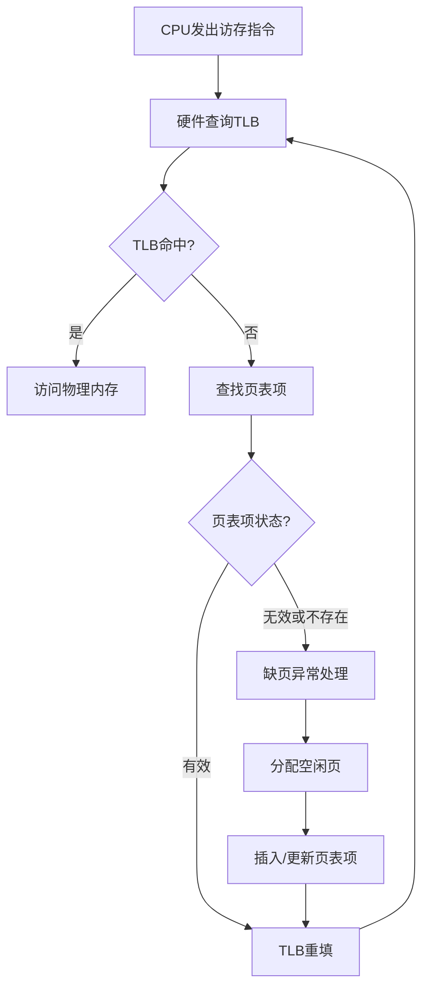
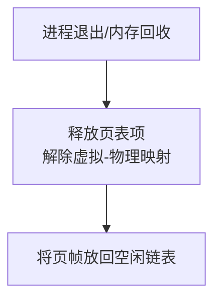

# 概览

## CPU 访存流程



## 内存回收流程



# 初始化内存管理

## `mips_detect_memory(u_int _memsize)` 检测可用内存

```C
void mips_detect_memory(u_int _memsize) {
    memsize = _memsize;
    npage = memsize / PAGE_SIZE;
    printk("Memory size: %lu KiB, number of pages: %lu\n", memsize / 1024, npage);
}
```

- 参数 `_memsize` 从哪来？

一般来说，在 bootloader 阶段，通过特定的寄存器传递内存信息。

- `npage` 是什么？

物理页的总数。由于我们将内存划分为大小相等的多个页，故用总内存空间除以页大小即可。

这个 `PAGE_SIZE` 在 `mmu.h` 头文件中有定义。

## `mips_vm_init()` 初始化

```C
void mips_vm_init() {
    pages = (struct Page *)alloc(npage * sizeof(struct Page), PAGE_SIZE, 1);
    printk("to memory %x for struct Pages.\n", freemem);
    printk("pmap.c:\t mips vm init success\n");
}
```

#### `pages` 是一个数组，解引用得到第一个 `Page`。

> **`struct Page`**
> 
> 页**控制块**的结构体，里面记录的是某一个物理页的信息。通过这个可以管理物理内存的分配。
> 
> 其定义可在 `pmap.h` 头文件中查看。
> 
> - `pp_ref` 字段：表示这一页被引用了多少次。换句话说，有几个虚拟页被映射到了这一个物理页。
> 
> - `pp_link` 字段：与链表有关的结构体，后续详细讲解。

### `alloc` 函数：

```C
void *alloc(u_int n, u_int align, int clear) {
    extern char end[];	// 链接器定义的符号，内核镜像结束后的第一个地址
    u_long alloced_mem;

    if (freemem == 0) {
        freemem = (u_long)end;
    }

    freemem = ROUND(freemem, align);	// 地址对齐
    alloced_mem = freemem;
    freemem = freemem + n;
    
    panic_on(PADDR(freemem) >= memsize);
    
    if (clear) {
        memset((void *)alloced_mem, 0, n);
    }
    
    return (void *)alloced_mem;
}
```

1. `freemem` 变量是什么？

	是一个地址，指的是未被分配的内存从这里开始。

2. 返回值 `alloced_mem` 有什么意义？

	这个返回值表示我们这次操作分配的内存的起点。实际上，这个就是第一个 `Page` 的地址，也就是 `pages` 数组的地址。

# 物理内存管理

## 概览

MIPS 框架下的操作系统（MOS）采用**分页管理**。

我们需要知道哪些物理页放入了页表中（即**有虚拟页与其映射**）、又有哪些页是**空闲的**（即**没有虚拟页与其映射**）。

#### MOS 采用了双向链表法管理空闲的页框。

> 需要注意的是：
> 
> 链表里面存储的仅有**空闲的**页框的**控制块**，即每个节点都是 `struct Page` 结构体；而 `pages` 数组里面是按顺序存储**所有**页框的控制块，无论是否被引用。
> 
> 所以，链表内的各个节点都是 `pages` 数组的元素。

我们需要做的事情有：

1. 初始化物理页管理；
2. 将一个空闲页分配出去；
3. 减少引用次数甚至回收到空闲页链表中。

## 链表结构与宏

![[链表结构.jpg]]

我们的代码中有这个变量：

```C
struct Page_list page_free_list;
```

也就是说，`page_free_list` 是整个链表结构的名字，严格来说应该是链表的头指针 `lh_first` 所在的**结构体的**名字。

> 注：下列宏中的 `field` 在调用的时候应该对应 `pp_link`；
> 
> `head` 在调用的时候应该对应 `&page_free_list`。

### 宏 `LIST_FIRST(head)`：获取第一个节点地址

```C
page_free_list.lh_first;
// 或者
&page_free_list->lh_first;
// 使用宏
LIST_FIRST(&page_free_list);
```

### 宏 `LIST_NEXT(elm, filed)`：获取该节点的下一个节点

```C
#define LIST_NEXT(elm, field) ((elm)->field.le_next)
```

我个人不推荐用这个宏，很容易搞混。但是遇到的时候得要会展开。

### 宏 `LIST_INSERT_AFTER(listelm, elm, field)`：插入到某一节点后面

```C
#define LIST_INSERT_AFTER(listelm, elm, field) \
    do { \
        (elm)->field.le_next = (listelm)->field.le_next; \
        if ((listelm)->field.le_next != NULL) { \
            (listelm)->field.le_next->field.le_prev = &(elm)->field.le_next; \
        } \
        (listelm)->field.le_next = (elm); \
        (elm)->field.le_prev = &(listelm)->field.le_next; \
    } while (0)
```

#### 特别注意： 仔细看上面我画的图，`le_next` 解引用后就是下一个节点，是整个页控制块，而 `le_prev` 解引用后得到上一个节点的 `le_next`。所以说 `le_prev` 是指针 `le_next` 的指针。

调用方法：`listelm` 和 `elm` 都是**页控制块的指针**。`elm` 对应的 `Page` 插入到 `listelm` 这个已经在链表中的 `Page` 的后面。所以，应该是以 `&pages[x]` 的形式作为参数。**别少了取址符**。

> 宏定义里大量使用小括号的原因是：由于宏定义是直接字符串替换，如果参数本身包含运算符，可能会出现优先级问题。

### 宏 `LIST_INSERT_BEFORE(listelm, elm, field)`：插入到某一节点前面

```C
#define LIST_INSERT_BEFORE(listelm, elm) \
    do { \
        (elm)->pp_link.le_prev = (listelm)->pp_link.le_prev; \
        (elm)->pp_link.le_next = (listelm); \
        *(listelm)->pp_link.le_prev = (elm); \
        (listelm)->pp_link.le_prev = &(elm)->pp_link.le_next; \
    } while (0)
```

在前面插入就不需要考虑指针为空的问题了。

### 宏 `LIST_INSERT_HEAD(head, elm, field)`：插入为第一个节点

```C
#define LIST_INSERT_HEAD(head, elm, field) \
    do { \
        if (((elm)->field.le_next = (head)->lh_first) != NULL) \
            (head)->lh_first->field.le_prev = &(elm)->field.le_next; \
        (head)->lh_first = (elm); \
        (elm)->field.le_prev = &(head)->lh_first; \
    } while (0)
```

### 宏 `LIST_REMOVE(elm, field)`：删除某一节点

```C
#define LIST_REMOVE(elm, field) \
    do { \
        if (LIST_NEXT((elm), field) != NULL) \
            LIST_NEXT((elm), field)->field.le_prev = (elm)->field.le_prev; \
        *(elm)->field.le_prev = LIST_NEXT((elm), field); \
    } while (0)
```

## 物理内存管理函数

- `page_init()`
- `page_alloc(struct Page **pp)`
- `page_decref(struct Page *pp)`
- `page_free(struct Page *pp)`

# 虚拟内存管理

## 地址转换函数

| 函数名        | 功能描述         | 输入                      | 输出                  |
| ---------- | ------------ | ----------------------- | ------------------- |
| `page2ppn` | 页控制块地址转页框号   | `struct Page *pp`       | `u_long` 页框号        |
| `page2pa`  | 页面结构体转物理地址   | `struct Page *pp`       | `u_long` 物理地址        |
| `pa2page`  | 物理地址转页面结构体   | `u_long pa`             | `struct Page *` 页面指针 |
| `page2kva` | 页面结构体转内核虚拟地址 | `struct Page *pp`       | `u_long` 内核虚拟地址      |
| `va2pa`    | 虚拟地址转物理地址    | `Pde *pgdir, u_long va` | `u_long` 物理地址        |

## 虚拟内存管理函数

| 函数签名                                                                              | 功能描述           | 参数说明                                                                                  | 返回值                       |
| --------------------------------------------------------------------------------- | -------------- | ------------------------------------------------------------------------------------- | ------------------------- |
| `int page_insert(Pde *pgdir, u_int asid, struct Page *pp, u_long va, u_int perm)` | 建立虚拟地址到物理页面的映射 | `pgdir`: 页目录指针  <br>`asid`: 地址空间 ID  <br>`pp`: 物理页面指针  <br>`va`: 虚拟地址 <br>`perm`: 权限标志 | 成功返回 0，失败返回错误码 `-E_NO_MEM` |
| `struct Page *page_lookup(Pde *pgdir, u_long va, Pte **ppte)`                     | 查询虚拟地址对应的物理页面  | `pgdir`: 页目录指针  <br>`va`: 虚拟地址 <br>`ppte`: 用于获取二级页表项指针的空指针                            | 成功返回页面指针，失败返回 NULL         |
| `void page_remove(Pde *pgdir, u_int asid, u_long va)`                             | 移除虚拟地址的映射      | `pgdir`: 页目录指针  <br>`asid`: 地址空间 ID  <br>`va`: 虚拟地址                                    | 无返回值                      |

