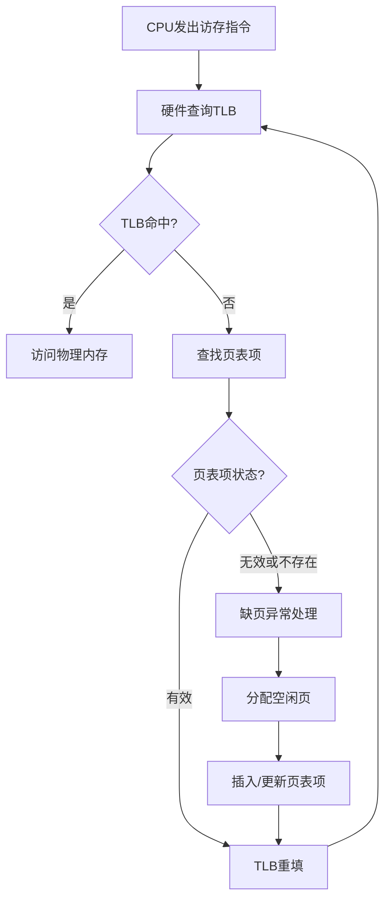
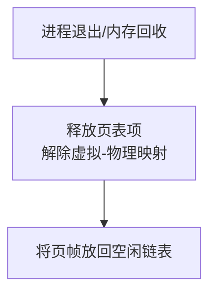

# 为什么要内存管理？

## 实现地址空间的独立

> 设想，假如没有内存管理，程序自己控制内存空间。那么，程序编译完成后，每个变量或指令的地址就确定了。
> 
> 看似没有什么问题，但如果计算机同时运行两段程序呢？假如两段程序都要把指令放在同一个地址，那么不就冲突了吗？

所以，内存管理必须要让多段程序的地址空间相互独立，一个程序不能访问另一个程序的空间，这也提高了安全性。

## 内存分配与回收

必须通过覆盖、交换等方法释放不再需要使用的内存、把需要资源的载入内存。

## 地址转换

> 既然程序的地址不能直接控制内存空间，那么说明程序给的地址和真实地址并不相同。那 CPU 如何找到真实的地址呢？

#### 程序编译链接后得到的地址是虚拟地址，实际执行时则根据物理地址操作。

### 地址空间

**地址空间是虚拟地址**（也叫逻辑地址）**的集合**。源程序经过编译之后得到的目标地址, 存在于它所限定的地址范围内，这个范围就是地址空间。

### 存储空间

**存储空间是物理地址的集合**。主存中一系列存储信息的物理单元，这些物理单元的地址就是物理地址。

## 内存碎片整理

在进程的进进出出（分配回收）中，某一时刻的内存大概率会是：进程与进程之间有空隙。这种现象就是**碎片**。

如果空隙过多但每个空隙又很小，就会导致：明明容量是足够的，但是空闲的部分没有连在一起，导致没有地方再放入新进程。

因此，内存管理还需要整理碎片，并在分配内存的时候采用合理的策略。具体内容后面再细说。

# 内存管理的方式

通常有三种方式管理内存：分区、分段、分页。这三种方式是平行关系，但在实际中往往组合起来使用。

## 分区管理

### 核心思想

将内存划分为几个大小不一的区，每个进程独占一个区。

> - 固定式分区：每个区的大小固定
> 
> - 可变式分区：区与区之间的边界可移动

### 分配算法

1. 首次适应算法（First Fit）：每个空白区按其在内存空间中地址递增的顺序连在一起，在为作业分配内存区域时，从这个空白区域链的始端开始查找，选择第一个足以满足请求的空白块。
   
2. 下次适应算法（Next Fit）：把内存空间中空白区构成一个循环链，每次为内存请求查找合适的分区时，总是从上次查找结束的地方开始，只要找到一个足够大的空白区，就将它划分后分配出去。
   
3. 最佳适应算法（Best Fit）：为一个作业选择分区时，总是寻找其大小最接近于作业所要求的内存区域。
   
4. 最坏适应算法（Worst Fit）：为作业选择内存区域时，总是寻找最大的空白区。

> **作业和进程**
> 
> 一个进程通常源自一个作业。当作业被操作系统选中并调入内存分配资源后，它就“变身”为进程。

[task]
[question]
可变分区存储分配算法中，（）算法总是挑选可以容纳作业的最大的空闲区进行分配。
[\question]
[answer]
最坏适应（Worst Fit）[\answer]
[analysis]
最坏适应算法（Worst Fit）在分配内存时，总是从所有能够满足作业要求的空闲分区中挑选最大的一个进行分配。其目的是尽量让剩余的空闲区仍然足够大，以便后续能够容纳较大的作业，但同时也可能导致较大的空闲区被分割成较小的碎片。[\analysis]
[\task]

[task]
[question]
在一个交换系统中，按内存地址排列的空闲区大小是: 10 KB、4 KB、20 KB、18 KB、7 KB、9 KB、12 KB 和 15 KB。对于连续的段请求：12 KB、10 KB、9 KB。使用 First Fit、Best Fit、Worst Fit 和 Next Fit 将找出哪些空闲区？
[\question]
[answer]
| 算法 | 分配结果 |
|------|----------|
| First Fit | 20 KB, 10 KB, 18 KB |
| Best Fit | 12 KB, 10 KB, 9 KB |
| Worst Fit | 20 KB, 18 KB, 15 KB |
| Next Fit | 20 KB, 18 KB, 9 KB |
[\answer]
[analysis]
空闲区按地址顺序排列为：10 KB、4 KB、20 KB、18 KB、7 KB、9 KB、12 KB、15 KB。

- **First Fit**：12 KB→20 KB；10 KB→10 KB；9 KB→18 KB。
    
- **Best Fit**：12 KB→12 KB；10 KB→10 KB；9 KB→9 KB。
    
- **Worst Fit**：12 KB→20 KB；10 KB→18 KB；9 KB→15 KB。
    
- **Next Fit**：12 KB→20 KB；10 KB→从 20 KB 之后找→18 KB；9 KB→从 18 KB 之后找→9 KB。
[\analysis]
[\task]

### 缺点

由于一个进程占一个分区，在固定式分区下，很容易导致一个分区没有用满，这称为**内碎片**。而如果采用可变式分区，则能显著减少内碎片的问题。但相应地，因为不能整体移动进程，导致进程之间会有很多小的空分区，甚至难以放入一个进程，这就是**外碎片**。

## 分段管理

### 核心思想

由于程序本身就会在编译和链接后被划分为 `.data`、`.text` 等多个段，所以可以按照这个特点，将内存也划分为多个段，段内保持连续，但段与段之间不一定连续。

多个进程可以共享段，如共享库。但是，不同进程的 `.data` 段会放在内存的不同段中，以保持独立性。

### 地址转换方法

虚拟地址的结构为【 段号 | 段内偏移 】。

根据段号找到段表对应的段基址。段基址加上段内偏移即为物理地址。

### 缺点

有些可变长的段在分配回收的过程中，会产生段与段之间的**外碎片**。

## 分页管理

分区和分段管理都还是会产生很大的碎片，如何才能让碎片最小化、最少化呢？

> Young 做了一个梦！梦见他变成了一只乌鸦，天气太热了，好想喝水！突然，他发现了一个装满水的玻璃瓶！好一个乌鸦喝水！
> 
> 玻璃瓶旁边有一堆大石子和一堆细沙。Young 由于听说过乌鸦喝水的故事，于是毅然决然选择了大石子，结果扔进去才发现，水全部填充在石子的空隙中了，石子塞满了水也没溢出！然后 Young 就这么渴死了！
> 
> 或许是老天爷的恩赐，Young 重生了，重生在他扔石子之前！这次他不能再渴死了，于是选择了堆细沙进去，果然水就涨起来了。
> 
> 所以说，要让水溢出去，就是要让填充物缝隙中的水尽量少，于是填充物选择细小的更好。Hmm，我能不能这么类比：瓶子是内存空间，填充物是进程，水是碎片。要让碎片尽量小，我只需要让进程尽量细碎化一点即可。怎么做？

### 核心思想

将内存空间和进程“切碎”成固定大小且等大的块，离散存放。

#### 内存块称为页框，进程地址空间块称为页。

页框和页的对应关系储存在页表中，记录每一页存放在哪一个页框里。支持分页的硬件部件叫做 MMU。

进程以页为单位装进内存。

> 这种方法大胆地打破了“进程地址空间必须连续”的限制，就像沙子一样，可以任意流动。

### 地址转换方法

虚拟地址的结构为【 页号 | 页内偏移 】。

根据页号找到页表对应的页框号。$物理地址 = 页框号 × 页大小 + 页内偏移$。

注意，和分段管理不同的是，分页管理的转换相当于移位拼接，而不是简单的加法。最终的物理地址的结构为【 页框号 | 页内偏移】。

### 缺点

若一页设计得很大，则很容易出现最后一页剩了很多空间没装满，即很大的**内碎片**。且由于要以页为单位装进内存，仍然会分配得不灵活。

若一页设计得很小，又会导致需要很大的页表。页表本身又会占据内存空间，太臃肿了。

### 多级页表

为了平衡上述左右脑互搏的问题，**又要保证页设计得尽量小**以减小内碎片，我们可以采用多级页表的方法，来**减少页表占用的内存**。就是，给页表再来个页表！实际上，这个高级页表叫做页目录。或者，也可以把页目录称为一级页表，页表称为二级页表。

这样，虚拟地址的结构就被划分为【 一级页表偏移量 | 二级页表偏移量 | 页内偏移】。

以一级页表基地址为准，加上一级页表偏移量，找到对应的一级页表项。这个项的结构为【 二级页表基地址 | 权限位】。权限位用于判断该表项是否有效等。

然后根据这个二级页表基地址，加上二级页表偏移量，找到对应的二级页表项。这个项的结构为【 物理页号（页框号） | 权限位】。

最终，物理地址的结构为【 物理页号 | 页内偏移】。

[task]
[question]
如图，要想访问物理地址 `0x326028`，需要使用哪个逻辑地址？
![[内存管理题图-物理转逻辑.png]]
[\question]
[answer]
`0x00C01028`
[\answer]
[analysis]
物理地址 `0x326028` 对应的页框号为 `0x326000`，页内偏移为 `0x028`。根据图中信息，构造二级页表索引为1、页目录索引为3、页内偏移为 `0x028` 的逻辑地址，即：`(3<<22) | (1<<12) | 0x028 = 0x00C01028`。[\analysis]
[\task]

### TLB

> 你以为多级页表就是最佳答案了吗？其实不然。如果页表级数过多，每次地址转换的时间就会很长，效率极大下降。
> 
> 记得上学期计组学的 cache 吗？我们可以为页表也设计一个高速缓存，将部分映射关系存放在这里，就不用再一级一级地查找了！

TLB中不区分一级、二级页表偏移量，而是合成为“虚页号”。

即，虚拟地址的结构为【 虚页号 | 页内偏移】。

快表项的结构为【 虚页号 | 物理页号】。

和之前类似，得到物理地址为【 物理页号 | 页内偏移】。

> 如果你认为：这不是又回到了单级页表了吗？
> 
> 那么你或许需要先回去看看 cache 的相关知识点。

> **相关术语中英对照表**
> 
> | 中文术语            | 英文全称                                     | 缩写             |
> | --------------- | ---------------------------------------- | -------------- |
> | **内存管理单元**​     | Memory Management Unit                   | **MMU**​       |
> | **快表**​         | Translation Lookaside Buffer             | **TLB**​       |
> | **页表**​         | Page Table                               | PT             |
> | **页表项**​        | Page Table Entry                         | **PTE**​       |
> | **页目录**​        | Page Directory                           | PD             |
> | **页目录项**​       | Page Directory Entry                     | **PDE**​       |
> | **虚页号**​        | Virtual Page Number                      | **VPN**​       |
> |**一级页表偏移量/页目录索引**|Page Directory Entry Index| **PDX**|
> |**二级页表偏移量/页表索引**|Page Table Entry Index|**PTX**|
> | **页框号 / 物理页号**​ | Page Frame Number / Physical Page Number | **PFN / PPN**​ |
> | **页内偏移**​       | Page Offset                              | Offset         |

# 自映射

## 目的

我们知道，页表是存储在物理地址空间中的。假如内核需要维护（读写）页表，那么我们需要知道页表的物理地址。但是用户态程序**不能直接获得页目录的物理地址**！只能通过虚拟地址查页表才能找到物理地址，这样就陷入了个死循环：

#### 需要读写页表，必须找到物理地址；要找到物理地址，必须读页表。

为了解决这个问题，MOS 采用了一种叫做“自映射”的方法，用一部分虚拟地址空间，映射到页表的物理地址空间。

这样还不够，因为你必须要在页目录里查，而页目录的物理地址还是不知道！所以，需要能够通过某些虚拟地址，按照正常的查页表方法，能够**找到页目录本身**，并通过 Offset 查到页目录中的任意一项。

## 实现方法

我们已经知道，虚拟地址划分为了三个部分：

【PDX|PTX|Offset】

我们要做的是能让这个虚拟地址直接找到页目录本身，**而页目录本身是一个特殊的页表**，所以页目录中一定有一项存储的就是页目录自身的物理地址。

设页目录的第 k 项是页目录自身，那么 **PDX 必须为 k**；

这还不够，还要再查一次，并且还是得要获取页目录自身。也就是说，我们已经查到了页目录，再要根据页目录查页目录本身。那么页目录的第几项是页目录本身呢？还是 k！所以，**PTX 还是必须为 k**。

这样一来，改变 Offset 的值，就能查询页目录中的每一个项（即每一个页表）了。

**既然 PDX 和 PTX 是固定的**，且由于 Offset 共 12 位，所以可以有 $2^{12}=4 KB$ 的虚拟地址空间来映射页目录中的所有项。

如果不想找到页目录，只想找某一个页表，那可以改变 PTX，这样就是正常查页表而非自映射了。共 22 位可变，也就是 $2^{22}=4 MB$。所以，

#### 共有 4 MB 的虚拟地址空间映射到 4 MB 的所有页表所在的物理地址空间。

更进一步地，如果连页表都不想找，只想找一个页，那连 PDX 都可以改变，这样总共有 $2^{32}=4 GB$，于是物理地址空间最多有 4 GB。（我们又从自映射返回到了普通分页管理！）

> **为什么所有页表所在的物理地址空间也是 4 MB**
> 
> - 从位数的角度来看
> 
> 一个页的大小为 4 KB，可以通过 Offset 的位数计算出来。
> 
> 而页表本身也是一个页，因此一个页表的大小也是 4 KB。
> 
> 共有 1024 个页表，可以通过 PDX 的位数计算出来。
> 
> 所以共需要 $1024*4 KB=4 MB$ 的物理地址空间。
> 
> - 从映射的角度来看
> 
> 由于一个虚拟地址要映射到一个物理地址，要映射到 4 MB 大小的物理地址空间，则必须要不小于 4 MB 的虚拟地址空间。
> 
> 在 MOS 中，我们用刚好 4 MB 的空间来映射，当然是合适的。
> 
> 在 Linux 等现代操作系统中，往往会留出更多的虚拟地址空间来映射页表，因为 Linux 的内核页表可能会动态扩展。

### 小结

| **情况** | **PDX 固定** | **PTX 固定等于 PDX** | **效果**             |
| ------ | ---------- | ---------------- | ------------------ |
| 1      | 是（特殊值 k）   | 是                | 访问**页目录自身**（自映射模式） |
| 2      | 是（指定值 p）   | 否                | 访问**第 p 个页表**​     |
| 3      | 否          | 否                | 访问任意物理页（普通内存访问）    |

## 具体方案

可以在虚拟地址空间中确定一个 4 MB 的空间，且低 22 位为 0（即只有 PDX 部分有数字，这样不会影响其他）。设这个空间的起始地址为 `PTbase`，则映射到页目录的虚拟地址为 `(PTbase) | (PTbase >> 10)`，以保证 PTX 与 PDX 相等。

### 通过 `Offset` 查页目录

我们通过 `PDX` 和 `PTX` 查到页目录后，需要用 `Offset` 进行页内偏移查找页目录项，以得到页表。

注意，`Offset` 是**按字节寻址**的！比如，你要查页目录项中页目录本身（即页目录第 k 项），则 `Offset` 应该为 $k*4$ 才对。即：` PTbase|(PTbase)>>10| (PTbase)>>20 `。（可以看作右移 22 位得到 k，然后再左移 2 位，相当于 $*4$）。

[task]
[question]
一个进程如果从虚拟地址 `0x77800000` 开始映射 `4MB` 大小页表空间，求第一级页表（页目录）的起始逻辑地址，并指出从哪个逻辑地址可以读出第一级页表（页目录）所在的物理页框号。说明理由。（注意B代表字节，一个32位地址占4字节）
对于32位地址字长，2级页表，`4KB` 页面大小，虚拟地址 `va`，一级页表索引10位，二级页表索引10位，页内偏移12位。
[\question]
[answer]
- 页目录起始逻辑地址：**`0x779DE000`**
- 读出页目录物理页框号的逻辑地址：**`0x779DE778`**
[\answer]
[analysis]
页表空间从0x77800000开始，每个页表项4字节，共1024个二级页表。页目录本身也是一个页表，其虚拟地址的高10位（一级索引）与自身在页目录中的索引相同，因此页目录起始地址 = `(PTE_BASE) | (PTE_BASE >> 10) = 0x77800000 | 0x1DE000 = 0x779DE000`。
页目录自映射表项地址 = 页目录起始地址 | `(PTE_BASE >> 20) = 0x779DE000 | 0x778 = 0x779DE778`，该地址存储页目录自身的物理页框号。[\analysis]
[\task]

# MOS具体实现方法

## 概览

### CPU 访存流程



### 内存回收流程



## 初始化内存管理

### `mips_detect_memory(u_int _memsize)` 检测可用内存

```C
void mips_detect_memory(u_int _memsize) {
    memsize = _memsize;
    npage = memsize / PAGE_SIZE;
    printk("Memory size: %lu KiB, number of pages: %lu\n", memsize / 1024, npage);
}
```

- 参数 `_memsize` 从哪来？

一般来说，在 bootloader 阶段，通过特定的寄存器传递内存信息。

- `npage` 是什么？

物理页的总数。由于我们将内存划分为大小相等的多个页，故用总内存空间除以页大小即可。

这个 `PAGE_SIZE` 在 `mmu.h` 头文件中有定义。

### `mips_vm_init()` 初始化

```C
void mips_vm_init() {
    pages = (struct Page *)alloc(npage * sizeof(struct Page), PAGE_SIZE, 1);
    printk("to memory %x for struct Pages.\n", freemem);
    printk("pmap.c:\t mips vm init success\n");
}
```

#### `pages` 是一个数组，解引用得到第一个 `Page`。

> **`struct Page`**
> 
> 页**控制块**的结构体，里面记录的是某一个物理页的信息。通过这个可以管理物理内存的分配。
> 
> 其定义可在 `pmap.h` 头文件中查看。
> 
> - `pp_ref` 字段：表示这一页被引用了多少次。换句话说，有几个虚拟页被映射到了这一个物理页。
> 
> - `pp_link` 字段：与链表有关的结构体，后续详细讲解。

-  `alloc` 函数：

```C
void *alloc(u_int n, u_int align, int clear) {
    extern char end[];	// 链接器定义的符号，内核镜像结束后的第一个地址
    u_long alloced_mem;

    if (freemem == 0) {
        freemem = (u_long)end;
    }

    freemem = ROUND(freemem, align);	// 地址对齐
    alloced_mem = freemem;
    freemem = freemem + n;
    
    panic_on(PADDR(freemem) >= memsize);
    
    if (clear) {
        memset((void *)alloced_mem, 0, n);
    }
    
    return (void *)alloced_mem;
}
```

1. `freemem` 变量是什么？

	是一个地址，指的是未被分配的内存从这里开始。

2. 返回值 `alloced_mem` 有什么意义？

	这个返回值表示我们这次操作分配的内存的起点。实际上，这个就是第一个 `Page` 的地址，也就是 `pages` 数组的地址。

## 物理内存管理

### 概览

MIPS 框架下的操作系统（MOS）采用**分页管理**。

我们需要知道哪些物理页放入了页表中（即**有虚拟页与其映射**）、又有哪些页是**空闲的**（即**没有虚拟页与其映射**）。

#### MOS 采用了双向链表法管理空闲的页框。

> 需要注意的是：
> 
> 链表里面存储的仅有**空闲的**页框的**控制块**，即每个节点都是 `struct Page` 结构体；而 `pages` 数组里面是按顺序存储**所有**页框的控制块，无论是否被引用。
> 
> 所以，链表内的各个节点都是 `pages` 数组的元素。

我们需要做的事情有：

1. 初始化物理页管理；
2. 将一个空闲页分配出去；
3. 减少引用次数甚至回收到空闲页链表中。

### 链表结构与宏

![[链表结构.jpg]]

我们的代码中有这个变量：

```C
struct Page_list page_free_list;
```

也就是说，`page_free_list` 是整个链表结构的名字，严格来说应该是链表的头指针 `lh_first` 所在的**结构体的**名字。

> 注：下列宏中的 `field` 在调用的时候应该对应 `pp_link`；
> 
> `head` 在调用的时候应该对应 `&page_free_list`。

- 宏 `LIST_FIRST(head)`：获取第一个节点地址

```C
page_free_list.lh_first;
// 或者
&page_free_list->lh_first;
// 使用宏
LIST_FIRST(&page_free_list);
```

- 宏 `LIST_NEXT(elm, filed)`：获取该节点的下一个节点

```C
#define LIST_NEXT(elm, field) ((elm)->field.le_next)
```

我个人不推荐用这个宏，很容易搞混。但是遇到的时候得要会展开。

- 宏 `LIST_INSERT_AFTER(listelm, elm, field)`：插入到某一节点后面

```C
#define LIST_INSERT_AFTER(listelm, elm, field) \
    do { \
        (elm)->field.le_next = (listelm)->field.le_next; \
        if ((listelm)->field.le_next != NULL) { \
            (listelm)->field.le_next->field.le_prev = &(elm)->field.le_next; \
        } \
        (listelm)->field.le_next = (elm); \
        (elm)->field.le_prev = &(listelm)->field.le_next; \
    } while (0)
```

#### 特别注意： 仔细看上面我画的图，`le_next` 解引用后就是下一个节点，是整个页控制块，而 `le_prev` 解引用后得到上一个节点的 `le_next`。所以说 `le_prev` 是指针 `le_next` 的指针。

调用方法：`listelm` 和 `elm` 都是**页控制块的指针**。`elm` 对应的 `Page` 插入到 `listelm` 这个已经在链表中的 `Page` 的后面。所以，应该是以 `&pages[x]` 的形式作为参数。**别少了取址符**。

> 宏定义里大量使用小括号的原因是：由于宏定义是直接字符串替换，如果参数本身包含运算符，可能会出现优先级问题。

- 宏 `LIST_INSERT_BEFORE(listelm, elm, field)`：插入到某一节点前面

```C
#define LIST_INSERT_BEFORE(listelm, elm) \
    do { \
        (elm)->pp_link.le_prev = (listelm)->pp_link.le_prev; \
        (elm)->pp_link.le_next = (listelm); \
        *(listelm)->pp_link.le_prev = (elm); \
        (listelm)->pp_link.le_prev = &(elm)->pp_link.le_next; \
    } while (0)
```

在前面插入就不需要考虑指针为空的问题了。

- 宏 `LIST_INSERT_HEAD(head, elm, field)`：插入为第一个节点

```C
#define LIST_INSERT_HEAD(head, elm, field) \
    do { \
        if (((elm)->field.le_next = (head)->lh_first) != NULL) \
            (head)->lh_first->field.le_prev = &(elm)->field.le_next; \
        (head)->lh_first = (elm); \
        (elm)->field.le_prev = &(head)->lh_first; \
    } while (0)
```

- 宏 `LIST_REMOVE(elm, field)`：删除某一节点

```C
#define LIST_REMOVE(elm, field) \
    do { \
        if (LIST_NEXT((elm), field) != NULL) \
            LIST_NEXT((elm), field)->field.le_prev = (elm)->field.le_prev; \
        *(elm)->field.le_prev = LIST_NEXT((elm), field); \
    } while (0)
```

### 物理内存管理函数

- `page_init()`
- `page_alloc(struct Page **pp)`
- `page_decref(struct Page *pp)`
- `page_free(struct Page *pp)`

## 虚拟内存管理

### 地址转换函数

| 函数名        | 功能描述         | 输入                      | 输出                  |
| ---------- | ------------ | ----------------------- | ------------------- |
| `page2ppn` | 页控制块地址转页框号   | `struct Page *pp`       | `u_long` 页框号        |
| `page2pa`  | 页面结构体转物理地址   | `struct Page *pp`       | `u_long`物理地址        |
| `pa2page`  | 物理地址转页面结构体   | `u_long pa`             | `struct Page *`页面指针 |
| `page2kva` | 页面结构体转内核虚拟地址 | `struct Page *pp`       | `u_long`内核虚拟地址      |
| `va2pa`    | 虚拟地址转物理地址    | `Pde *pgdir, u_long va` | `u_long`物理地址        |

### 虚拟内存管理函数

| 函数签名                                                                              | 功能描述           | 参数说明                                                                                  | 返回值                       |
| --------------------------------------------------------------------------------- | -------------- | ------------------------------------------------------------------------------------- | ------------------------- |
| `int page_insert(Pde *pgdir, u_int asid, struct Page *pp, u_long va, u_int perm)` | 建立虚拟地址到物理页面的映射 | `pgdir`: 页目录指针  <br>`asid`: 地址空间ID  <br>`pp`: 物理页面指针  <br>`va`: 虚拟地址 <br>`perm`: 权限标志 | 成功返回0，失败返回错误码 `-E_NO_MEM` |
| `struct Page *page_lookup(Pde *pgdir, u_long va, Pte **ppte)`                     | 查询虚拟地址对应的物理页面  | `pgdir`: 页目录指针  <br>`va`: 虚拟地址 <br>`ppte`: 用于获取二级页表项指针的空指针                            | 成功返回页面指针，失败返回NULL         |
| `void page_remove(Pde *pgdir, u_int asid, u_long va)`                             | 移除虚拟地址的映射      | `pgdir`: 页目录指针  <br>`asid`: 地址空间ID  <br>`va`: 虚拟地址                                    | 无返回值                      |

