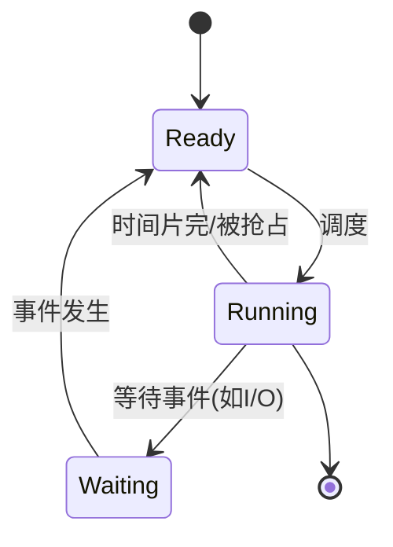

# 概述

## 并发与并行

### 并发

如果两个活动的起止时间有重叠，则称两个活动是并发执行的。

### 并行

如果两个程序在在同一时间运行在不同的处理机上，则成为并行执行。

#### 并行一定是并发。

### 并发的特征

1. 间断性
2. 非封闭性
3. 不可再现性

> **程序顺序执行的特征**
> 
> 1. 顺序性
> 
> 2. 封闭性
> 
> 3. 可再现性

### Bernstein 条件

#### 两个进程可并发，当且仅当两个进程对同一共享变量只能同时读。

即：对于任意一个共享变量，一读一写或者两个都是写的情况都是不行的。

#### 伯恩斯坦条件是判断并发程序结果可再现的充分条件。

可以这么理解：假如两个都是写，那么这个变量最后的值取决于谁最后写这个变量。此时，如果改变两个进程的运行顺序，那么变量最后的值就难以预测，有可能再现失败。

## 进程

### 程序、进程、作业的关系

| **对比项**   | **程序**      | **进程**        | **作业**               |
| --------- | ----------- | ------------- | -------------------- |
| **本质**​   | 静态的指令集合（文件） | 程序的**动态**执行过程 | 用户要求计算机完成的某项任务（工作集合） |
| **状态**​   | 永久          | 暂时，有生命周期      | 有提交、收容、执行、完成阶段       |
| **组成**​   | 代码          | 程序 + 数据 + PCB | 通常包括程序、数据、操作说明书      |
| **对应关系**​ | 一个程序可对应多个进程 | 一个进程可执行多个程序   | 一个作业可由多个进程组成         |
| **调度单位**​ | 否           | 是（传统OS中）      | 批处理系统中提交的实体          |

### 进程控制块

进程存在的**唯一标志**，管理和控制进程的核心数据结构。

### 进程的三大基本状态

#### 就绪、运行、阻塞。

- 就绪：已获得除 CPU 外的所有资源。
- 运行：正在 CPU 上执行。
- 阻塞：等待某事件完成。

## 线程

进程中的一个实体，是 CPU**调度和分派的基本单位**，只拥有必不可少的少量资源（如程序计数器、栈、寄存器状态），与同进程的其他线程共享所有进程资源。

# 进程管理

## 概览

进程管理包括进程调度、同步、互斥、通信等。

# MOS 具体实现方法

## 概览

初始化后，创建进程，然后处理异常。