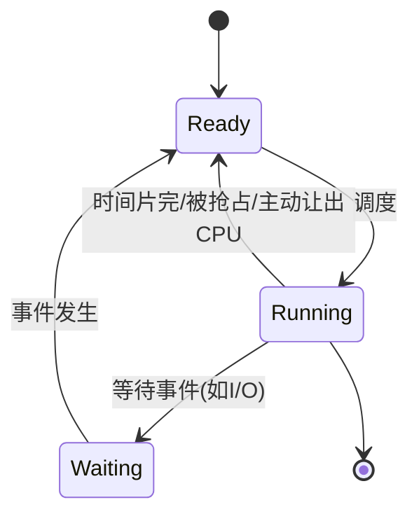

# 概述

## 为什么要引入进程

> 众所周知，人的速度是远远比不上 CPU 的。如果像早期单道批处理系统一样，一个程序没有运行完，就不会运行下一个，那么 CPU 的使用效率将会很低。
> 
> 所以，多道批处理系统应运而生，而其实现的原理就是进程。

#### 进程模型的引入，让 CPU 可以轮流执行不同的进程，防止 CPU 资源的浪费。

> 那么，进程到底是什么？如何实现？会产生什么问题，需要如何解决？
> 
> 请看下文分解。

## 并发与并行

### 并发

如果两个活动的起止时间有重叠，则称两个活动是并发执行的。

> 也就是说，从宏观上看，两个活动有同时进行的时段。但从微观上看不一定，有可能是一小段一小段交替进行。

### 并行

如果两个程序在在同一时间运行在不同的处理机上，则成为并行执行。

#### 并行一定是并发。

> 并行必须依赖多核 CPU 或者多台机器。对于我们一般只考虑的单核 CPU，不可能并行。

### 并发的特征

1. 间断性
2. 非封闭性
3. 不可再现性

> **程序顺序执行的特征**
> 
> 1. 顺序性
> 
> 2. 封闭性
> 
> 3. 可再现性

### Bernstein 条件

#### 两个进程可并发，当且仅当两个进程对同一共享变量只能同时读。

即：对于任意一个共享变量，一读一写或者两个都是写的情况都是不行的。

#### 伯恩斯坦条件是判断并发程序结果可再现的充分条件。

可以这么理解：假如两个都是写，那么这个变量最后的值取决于谁最后写这个变量。此时，如果改变两个进程的运行顺序，那么变量最后的值就难以预测，有可能再现失败。

[task]
[question]
下面哪种情况不会产生数据竞争：
[\question]
[options]A 两个进程依次串行访问共享变量[\options]
[options]B 两个进程同时访问共享变量，同时为读[\options]
[options]C 两个进程同时访问共享变量，同时为写[\options]
[options]D 两个进程同时访问共享变量，一个读一个写[\options]
[answer]AB[\answer]
[analysis]
数据竞争（data race）是指两个或多个进程/线程并发访问同一共享变量，且**至少有一个访问是写操作**，同时没有使用同步机制。

选项 A 中两个进程**依次串行**访问，不存在并发，不会产生数据竞争。

选项 B 中两个进程**同时读**，没有写操作，也不会产生数据竞争。

选项 C 中两个进程**同时写**，选项 D 中**一个读一个写**，均满足数据竞争的定义条件。[\analysis]
[\task]

## 进程

### 程序、进程、作业的关系

| **对比项**   | **程序**      | **进程**        | **作业**               |
| --------- | ----------- | ------------- | -------------------- |
| **本质**​   | 静态的指令集合（文件） | 程序的**动态**执行过程 | 用户要求计算机完成的某项任务（工作集合） |
| **状态**​   | 永久          | 暂时，有生命周期      | 有提交、收容、执行、完成阶段       |
| **组成**​   | 代码          | 程序 + 数据 + PCB | 通常包括程序、数据、操作说明书      |
| **对应关系**​ | 一个程序可对应多个进程 | 一个进程可执行多个程序   | 一个作业可由多个进程组成         |
| **调度单位**​ | 否           | 是（传统OS中）      | 批处理系统中提交的实体          |

### 进程控制块

进程存在的**唯一标志**，管理和控制进程的核心数据结构。

> 进程控制块中主要包含：
> 
> - 进程标识符（PID）、用户标识符；
> 
> - 进程状态、优先级（详见[[#调度]]）等信息；
> 
> - 上下文（保存各寄存器的值，在进程切换时尤为关键）；
> 
> - 资源清单（如代码段、数据段的指针等）。

### 进程的三大基本状态

#### 就绪、运行、阻塞。

- 就绪：已获得除 CPU 外的所有资源。
- 运行：正在 CPU 上执行。
- 阻塞：等待某事件完成。

> 下图暂时看不懂不要紧，学完调度后再看就应该懂了。



[task]
[question]
在操作系统进程状态模型中，进程从运行态转换到就绪态的条件是\_\_\_\_\_\_\_\_\_\_\_\_\_\_\_\_\_。
[\question]
[answer]
时间片用完 / 被更高优先级进程抢占 / 主动让出 CPU
[\answer]
[analysis]
进程从运行态（Running）转换到就绪态（Ready）表示进程暂时放弃 CPU，但仍在内存中等待下一次调度。常见条件包括：
1. **时间片用完**：分时系统中进程用完分配的时间片，被调度程序切换出去。
2. **被高优先级进程抢占**：在抢占式调度中，更高优先级的进程进入就绪队列。
3. **主动让出 CPU**：进程调用 `sched_yield()` 等系统调用主动放弃 CPU。
注意：若进程因等待 I/O 或事件而暂停，则从运行态转换到**阻塞态**（Waiting/Blocked），而非就绪态。[\analysis]
[\task]

[task]
[question]
一个进程被唤醒意味着该进程重新占有了 CPU。（）
[\question]
[options]A 正确[\options]
[options]B 错误[\options]
[answer]B[\answer]
[analysis]
注意，**阻塞态不能直接转换到运行态**。

进程被唤醒是指进程从**阻塞态**转换到**就绪态**，表示该进程所等待的事件（如 I/O 完成、信号量释放）已经发生，进程重新获得被调度执行的资格。但**并不等于立即占有 CPU**。被唤醒的进程会进入就绪队列，等待调度程序在合适的时候分配 CPU。因此该说法错误。[\analysis]
[\task]

## 线程

> 进程是资源分配的单位，但创建、切换、销毁进程的代价较大，比如要单独分配地址空间。
> 
> 为了减少开销，并进一步提高并发度，可以将进程继续细分为若干个线程。

进程中的一个实体，是 CPU**调度和分派的基本单位**，只拥有必不可少的少量资源（如程序计数器、栈、寄存器状态），与同进程的其他线程共享所有进程资源，因此同一进程的多个进程间切换开销很小。

### 用户级线程

线程的创建、切换、销毁等操作都在**用户态**完成。内核不知道线程的存在，只知道进程。

- 优点
1. 线程切换不需要陷入内核，节省了模式切换的开销。
2. 不同进程可以选择不同的线程调度算法。

- 缺点
1. 由于内核不知道线程的存在，当一个线程执行系统调用时，**必须阻塞该进程的所有线程**。不然，如果同时系统调用，那么内核返回的数据只知道给进程，不知道给哪个线程才好。
2. 同一时刻进程中仅有一个线程能执行。如果是多核 CPU，无法发挥多核优势。

### 内核级线程

内核给各个线程也设置一个线程控制块（TCB）来对线程直接控制。

- 优点
1. 能发挥多核 CPU 的优势。
2. 若进程中的一个线程被阻塞，内核可以调度该线程或其他线程的其他线程来占用 CPU。
- 缺点
1. 同一进程间的线程切换也需要从用户态转到内核态执行，模式切换的开销大。

---

[task]
[question]
如果内核级线程在执行系统调用时被阻塞，会阻塞与该进程相关的所有线程。
[\question]
[options]A 正确[\options]
[options]B 错误[\options]
[answer]B[\answer]
[analysis]
内核级线程由内核直接管理和调度，每个线程是独立的调度单位。当一个内核级线程执行系统调用而被阻塞（例如等待 I/O）时，内核可以继续调度该进程中的**其他就绪线程**执行，而不会被阻塞线程所影响。因此，阻塞的是当前线程，不会阻塞与该进程相关的所有线程。

该说法描述的是用户级线程的特性（用户级线程阻塞会导致整个进程阻塞）。所以说法错误。[\analysis]
[\task]

---

---

[task]
[question]
关于线程与进程，错误的是_ 。
[\question]
[options]A 一个进程可以拥有多个线程，而一个线程同时只能被一个进程所拥有[\options]
[options]B 进程是资源分配的基本单位，线程是处理机调度的基本单位[\options]
[options]C 使用线程能够更好的释放多核系统的性能[\options]
[options]D 相比单线程，使用多线程总能获得更好的性能[\options]
[answer]D[\answer]
[analysis]
- 选项 A 正确：进程是线程的容器，一个进程可包含多个线程，每个线程属于唯一的进程。
- 选项 B 正确：进程拥有独立的地址空间和资源，是资源分配的基本单位；线程共享进程资源，是 CPU 调度的基本单位。
- 选项 C 正确：多线程可将任务分配到多个 CPU 核心上并行执行，充分利用多核系统的性能。
- 选项 D **错误**：多线程并非总能获得更好的性能。线程切换、同步开销、资源竞争、数据局部性、Amdahl 定律等因素可能导致多线程性能提升有限甚至下降（如频繁锁竞争导致效率低于单线程）。因此“总能”的说法错误。[\analysis]
[\task]

# 调度【!】

> 前文中已经出现了多次“调度”一词了。
> 
> 简单来说，调度就是在一群人中选择最合适的一个人出来，然后做对应的事。

## 调度的层次

### 高级调度——作业调度

将作业调度进内存，并为其创建进程。

### 中级调度——内存调度

将挂起队列中的进程调度进内存。

### 低级调度——进程调度

从就绪队列中为进程分配 CPU。

> 我们主要关注的是进程调度。

## 调度的目标（性能指标）

### CPU 利用率

$$
CPU的利用率=\frac{CPU有效工作时间}{CPU有效工作时间+CPU空闲等待时间}
$$

### 系统吞吐量

单位时间 CPU 完成作业的数量。

### 周转时间

$$
周转时间=作业完成时间-作业提交时间
$$

### 带权周转时间

$$
带权周转时间=\frac{作业周转时间}{作业实际运行时间}
$$

### 等待时间

指进程处于等待 CPU 的总时间。

### 响应时间

指进程从提交到系统首次响应所用的时间。

## 批处理调度算法

### 先来先服务（FCFS）

First Come First Serve (FCFS)

#### 非抢占式的算法，最简单但也是效率最低的算法。

排在长作业后的短作业需要排很长时间才能排到，因此对长作业有利，对短作业不利。

### 短作业优先（SJF）

Shortest Job First (SJF)

#### 非抢占式的算法，平均等待时间和平均周转时间是最优的。

短作业会优先于长作业，导致对短作业有利而对长作业不利，且有可能因为源源不断到来短作业，导致长作业长时间得不到服务，称为“**饥饿**”，甚至“饿死”。

### 最短剩余时间优先（SRTN）

Shortest Remaining Time Next (SRTN)

#### 短作业优先的抢占式版本。

对长作业更不利，因为会频繁被抢断。

### 高响应比优先（HRRN）

Highest Response Ratio Next (HRRN)

$$
响应比 = \frac{等待时间+要求服务时间}{要求服务时间}
$$

该算法是对 FCFS 和 SJF 的综合考虑，同时考虑了作业的等待时间和预计运行时间，一定程度上缓解了长作业饥饿的现象。

[task]
[question]
以下说法不正确的是（）
[\question]
[options]A FCFS 调度算法对于长作业有利[\options]
[options]B SJF 调度算法会引起长作业被“饿死”的现象[\options]
[options]C SRTF 调度算法中正在执行的作业会因为新作业到达而被中断执行[\options]
[options]D HRRF 调度算法中，一个作业要求运行的时间越长，其响应比越大[\options]
[answer]D[\answer]
[analysis]
选项 A、B、C 均正确，选项 D 错误。
- 选项 A 正确：FCFS（先来先服务）算法中，长作业一旦开始执行会持续占用 CPU，短作业需要等待，因此对长作业有利。
- 选项 B 正确：SJF（短作业优先）算法中，若短作业不断到达，长作业可能永远得不到 CPU，产生“饿死”现象。
- 选项 C 正确：SRTF（最短剩余时间优先）是抢占式算法，新作业的剩余时间更短时会抢占当前正在执行的作业。
- 选项 D **错误**：HRRF（最高响应比优先）的响应比计算公式为 $\frac{(等待时间 + 要求运行时间) } {要求运行时间} = 1 + \frac{等待时间}{要求运行时间}$。要求运行时间越长，响应比中的分母越大，在其他条件相同时响应比反而越小。[\analysis]
[\task]

[task]
[question]
某系统采用多级队列调度算法，设有以下两个队列：
- 高优先级队列 Q 1：采用时间片轮转（RR）调度，时间片长度为 2。
- 低优先级队列 Q 2：采用先来先服务（FCFS）调度。

调度规则如下：
1. 新到达的进程首先进入 Q 1。
2. 若进程在 Q 1 中用完一个时间片后未完成，则被移入 Q 2。
3. 仅当 Q 1 为空时，才调度 Q 2 中的进程。
4. 进程一旦开始执行，就不会被打断，除非时间片用完。

进程到达时间和执行时间：

P 1：到达 0，执行 8

P 2：到达 1，执行 4

P 3：到达 2，执行 5

P 4：到达 3，执行 2

1. 画出各进程的调度时序图（或写出每个时间段运行的进程）。
2. 计算每个进程的完成时间和周转时间。
3. 求所有进程的平均周转时间。
[\question]
[answer]
**1. 调度时序图**

| 时间区间 | 运行的进程 |
|----------|------------|
| 0～2 | P 1 |
| 2～4 | P 2 |
| 4～6 | P 3 |
| 6～8 | P 4 |
| 8～14 | P 1 |
| 14～16 | P 2 |
| 16～19 | P 3 |

**2. 完成时间与周转时间**

| 进程 | 到达时间 | 执行时间 | 完成时间 | 周转时间 |
|------|----------|----------|----------|----------|
| P 1 | 0 | 8 | 14 | 14 |
| P 2 | 1 | 4 | 16 | 15 |
| P 3 | 2 | 5 | 19 | 17 |
| P 4 | 3 | 2 | 8 | 5 |

**3. 平均周转时间**

平均周转时间 = (14 + 15 + 17 + 5) / 4 = 51 / 4 = **12.75**
[\answer]
[analysis]
调度规则：新进程进入 Q 1（RR，时间片 2），用完时间片未完成则移至 Q 2（FCFS）。仅当 Q 1 为空时调度 Q 2。

时间线模拟：
- 0 时刻：P 1 到达 Q 1，执行 0~2（P 1 剩余 6，移入 Q 2）。
- 2 时刻：Q 1 中有 P 2（到达 1）、P 3（到达 2），按 FCFS 取 P 2 执行 2 ~ 4（P 2 剩余 2，移入 Q 2）。
- 4 时刻：Q 1 中有 P 3，执行 4~6（P 3 剩余 3，移入 Q 2）。
- 6 时刻：Q 1 中有 P 4（到达 3），执行 6~8（P 4 完成，退出）。
- 8 时刻：Q 1 为空，调度 Q 2（FCFS 顺序：P 1，P 2，P 3）。P 1 执行 8 ~ 14（剩余 6 完成），P 2 执行 14 ~ 16（剩余 2 完成），P 3 执行 16 ~ 19（剩余 3 完成）。

周转时间 = 完成时间 - 到达时间。平均周转时间 = 51/4 = 12.75。
[\analysis]
[\task]

# 进程同步

## 同步与互斥的概念

### 临界区

**临界资源**：我们将一次仅允许一个进程访问的资源称为临界资源（如打印机）。

**临界区**：每个进程中访问临界资源的那段代码称为临界区。

### 进程互斥

两个或两个以上的进程，不能同时进入关于同一组共享变量的临界区域，否则可能发生与时间有关的错误，这种现象被称作进程互斥。

#### 程序一般不希望会出现进程互斥。

### 进程同步

进程同步是进程间的一种**刻意安排的**直接制约关系。即为完成同一个任务的各进程之间，因需要协调它们的工作而相互等待、相互交换信息所产生的制约关系。

进程同步的目的是：系统中各进程之间能有效地共享资源和相互合作，从而使程序的执行具有**可再现性**。

## 临界区管理

### 临界区管理的条件

1. 没有进程在临界区时，想进入临界区的进程可进入。
2. 任何两个进程都不能同时进入临界区。
3. 当一个进程运行在它的临界区外面时，不能妨碍其他的进程进入临界区。
4. 任何一个进程进入临界区的要求应该在有限时间内得到满足。

### 同步机制应遵循的原则

根据临界区管理的条件，在设计同步机制的时候必须遵循以下原则：

1. 空闲让进；
2. 忙则等待；
3. 让权等待；
4. 有限等待。

### 基于忙等待的软件方法

- Dekker 算法（软件方法）

1. 表示自己想进入临界区（`flag[i] = 1`）；
2. 如果另一个进程也想进入临界区，则查看是否轮到自己（`turn == i`）；
3. 若轮到自己，则进入；否则，主动放弃（`flag[i] = 0`），并循环等待机会（**忙等**）。

---

- Peterson 算法（软件方法）

1. 表示自己想进入临界区（`flag[i] = 1`）；
2. 主动将机会让给别人（`turn = j`）；
3. 若别人也想进入，则循环等待机会（**忙等**）。

```C
void enter_region(int progress) {
    int other;
    other = 1 - progress;
    // 另一个进程的进程号
    interested[progress] = TRUE;
    // 表明本进程感兴趣
    turn = progress;
    // 设置标志位
    while (turn == other && interested[other] == TRUE);
}
void leave_region(int progress) {
    interested[progress]  = FALSE;
}
```

[task]
[question]
Peterson 临界区算法适合哪种情况的调度：
[\question]
[options]A 抢占式[\options]
[options]B 非抢占式[\options]
[answer]A[\answer]
[analysis]
Peterson 算法适用于**抢占式调度**环境。它通过共享变量（`flag` 和 `turn`）在两个进程之间协调进入临界区的权限，假设进程可能在任何时刻被抢占并切换到另一个进程。在非抢占式调度下，进程会一直运行直到主动让出 CPU，此时临界区问题更容易解决（例如直接禁止中断），不需要 Peterson 算法这样复杂的软件方案。因此 Peterson 算法主要针对抢占式调度设计。[\analysis]
[\task]

---

- Bakery 算法（软件方法）

1. 进入临界区前，先取个号（取为当前最大号 + 1）；
2. 优先级为序号更小 > ID 更小；
3. 如果当前进程不是优先级最高的，循环等待机会（**忙等**）。

```C
void entrySection(int i) {
    Choosing[i] = true;
    Number[i] = 1 + maxNumber();
    Choosing[i] = false;
​
    for (int j = 0; j < N; j++) {
        // 等待直到进程j完成编号选择
        while (Choosing[j]) {
            // skip
        }
​
        // 等待直到编号小于或等于自己的所有进程都离开临界区
        while ((Number[j] != 0) && ((Number[j] < Number[i]) || (Number[j] == Number[i] && j < i))) {
            // skip
        }
    }
}
```

> **忙等待的局限性**
> 
> 通过以下的例题进行补充说明。

[task]
[question]
忙等存在什么问题？
[\question]
[options]A 节省 CPU 资源[\options]
[options]B 可能导致优先级反转[\options]
[answer]B[\answer]
[analysis]
忙等（busy waiting）是指进程在等待某个条件成立时持续占用 CPU 并不断循环检查，而不是主动让出 CPU。这会带来以下问题：浪费 CPU 时间、降低系统吞吐量，并可能**导致优先级反转**——例如高优先级进程等待低优先级进程释放锁，而低优先级进程无法运行（被更高优先级进程抢占），高优先级进程持续忙等，形成死锁。

选项 A 错误，忙等恰恰是浪费 CPU 资源而非节省。[\analysis]
[\task]

### 基于忙等待的硬件方法

- 中断屏蔽

在临界区操作时禁用中断。

这种方法简单但不适用于多 CPU 系统。

---

- 自旋锁

当锁被占用时，循环直至锁被释放。

[task]
[question]
在单处理器系统中，内核可以通过禁用中断来实现内核数据结构的安全访问，而不需要使用任何自旋锁。（）
[\question]
[options]A 正确[\options]
[options]B 错误[\options]
[answer]A[\answer]
[analysis]
在单处理器系统中，同一时刻只有一个 CPU 在执行。内核数据结构的安全访问主要面临两个并发风险：中断处理程序与内核代码之间的并发，以及内核态抢占（若开启）带来的并发。通过**禁用中断**可以阻止中断处理程序打断当前内核代码，若同时禁止内核抢占（或系统为非抢占式内核），则当前内核代码可以独占 CPU 完成对数据结构的操作，无需自旋锁。自旋锁主要解决多 CPU 环境下的忙等同步问题，在单处理器系统中通常不需要。因此该说法正确。[\analysis]
[\task]

### 基于信号量的方法

`S.value > 0` 时表示资源的个数，`S.value < 0` 时表示等待进程的个数。

`P` 操作表示分配资源，`S.value--`，如果无法分配则阻塞（`wait`）；

`V` 操作表示释放资源，`S.value++`， 如果有等待进程则唤醒 （`signal`）。

```C
typedef struct {
  int value;
  struct Process *L;
} semaphore;

void P(sempaphore s) {
  s.value--;
  if (s.value < 0) {
    block(s.L)
  }
}

void V(semaphore s) {
  s.value++;
  if (s.value <= 0) {
    // <=0是因为需要看++前是否<0
    wakeup(s.L);
  }
}
```

[task]
[question]
多个线程之间共享访问变量 x（初值为 0），为了保障线程之间的同步，定义了一个互斥信号量 mutex（初值为 1），并用 PV 操作来实现同步，伪代码如下。请分析代码是否保证了线程对变量 x 的互斥访问？X 的取值是否可能大于 1？并给出解释。

```
// code for thread i
P(mutex);
if (x == 0) {
    V(mutex);
    P(mutex);
    x++;
}
V(mutex);
```

[\question]
[answer]
- **是否保证互斥访问？** 否，未保证。
- **x 是否可能大于 1？** 是，可能大于 1。
[\answer]
[analysis]
**问题分析**：线程在 `if (x == 0)` 条件成立后，先执行 `V(mutex)` 释放锁，再执行 `P(mutex)` 重新加锁。在释放锁到重新加锁之间的间隙，其他线程可以进入临界区。

**并发示例**（初始 x=0，mutex=1）：
1. T 1：`P(mutex)` 成功，mutex=0，检查 `x==0` 成立。
2. T 1：`V(mutex)`，mutex=1。
3. T 2：`P(mutex)` 成功，mutex=0，检查 `x==0` 仍成立（T 1 尚未执行 x++）。
4. T 2：`V(mutex)`，mutex=1，`P(mutex)` 成功，`x++`，x=1，`V(mutex)`。
5. T 1：继续执行 `P(mutex)` 成功，`x++`，x=2。

因此多个线程可以同时进入 if 块，导致 x 被多次增加，最终 x 可能等于同时进入的线程数（大于 1）。互斥访问未得到保证。

**改进方案**：将整个 `if (x == 0) { x++; }` 放在同一对 `P(mutex)` / `V(mutex)` 之间。
[\analysis]
[\task]

## 经典同步问题

# 死锁

死锁是指多个进程互相等待对方手里的资源导致各个进程都被阻塞的情形。

## 死锁产生的必要条件

1. 互斥条件；
2. 不可剥夺条件；
3. 请求并保持条件；
4. 循环等待条件。

## 死锁的处理策略

1. **死锁预防**：破坏产生死锁的 4 个必要条件中的若干个。
2. **死锁避免**：在资源的动态分配过程中，防止系统进入不安全状态。
3. **死锁检测及解除**：允许发生死锁，但需要及时检测出死锁的存在，然后采取措施解除死锁。

### 死锁预防

1. 破坏**互斥条件**：将只能互斥使用的资源改造成允许共享使用。（不是所有的资源都可以这样）。
2. 破坏**不可剥夺条件**：当请求新资源不能满足时，释放已经保持的资源。（仅适合状态易于保存和恢复的资源）
3. 破坏**请求并保持条件**：可以预先一次性请求所有需要的资源；也可以让进程在释放完所有已经使用完毕的资源后，才能继续申请其他资源。
4. 破坏**循环等待条件**：给各类资源编号，请求顺序为只能申请编号递增的资源，而不能逆向申请编号更小的资源，以避免循环。

### 系统安全状态

安全状态是指系统能按某种进程推进顺序为每个进程分配其所需的资源，直至满足每个进程对资源的最大需求，使每个进程都可顺利完成。

此时，成该推进顺序为安全序列（可能有多个）。

若系统无法找到一个安全序列，则称系统处于不安全状态。

[task]
[question]
假设具有5个进程的进程集合P=｛P0,P1,P2,P3,P4｝，考虑CPU和内存两类资源，假设在某时刻有如下状态：

已分配（CPU核, 内存MB）：P0(2,2), P1(1,6), P2(1,15), P3(4,7), P4(4,12)
最大需求（CPU核, 内存MB）：P0(5,10), P1(6,7), P2(4,20), P3(10,8), P4(12,15)
剩余可利用资源：（4核, 6MB）

系统当前是否安全？若安全请给出安全序列；若不安全说明原因。
[\question]
[answer]
系统处于**安全状态**，安全序列：**P2 → P0 → P1 → P3 → P4**（P 0 与 P 1 顺序可交换，P 3 与 P 4 顺序可交换）
[\answer]
[analysis]
**1. 计算还需资源 Need = Max - Allocation**

| 进程 | Need(CPU, 内存) |
|------|----------------|
| P0 | (3, 8) |
| P1 | (5, 1) |
| P2 | (3, 5) |
| P3 | (6, 1) |
| P4 | (8, 3) |

**2. 安全性检查（初始 Available = (4,6)）**

- P2 Need $(3,5) \leq (4,6)$ ✅ → 执行 P2，释放 $(1,15)$，Available 变为 $(5,21)$
- P0 Need $(3,8) \leq (5,21)$ ✅ → 执行 P0，释放 $(2,2)$，Available 变为 $(7,23)$
- P1 Need $(5,1) \leq (7,23)$ ✅ → 执行 P1，释放 $(1,6)$，Available 变为 $(8,29)$
- P3 Need $(6,1) \leq (8,29)$ ✅ → 执行 P3，释放 $(4,7)$，Available 变为 $(12,36)$
- P4 Need $(8,3) \leq (12,36)$ ✅ → 执行 P4，全部完成

所有进程均可按序完成，故系统安全。安全序列为 **P2, P0, P1, P3, P4**（P0与P1顺序可交换，P3与P4顺序可交换）。
[\analysis]
[\task]

### 死锁避免（如银行家算法）

[task]
[question]
某系统有 m 台互斥使用的同类设备，n 个并发进程完成执行分别需要 1，2，3，…，n 台设备。求 m 的最小值，使系统不会发生死锁。
[\question]
[answer]
$M = n (n-1)/2 + 1$
[\answer]
[analysis]
最坏情况：每个进程都只差 1 台设备就能满足需求。需要 k 台设备的进程已持有 $k-1$ 台，此时已分配设备总数为 $0+1+2+…+(n-1)= n (n-1)/2$。此时若再有 1 台设备可用，则至少有一个进程能获得所需全部设备并执行完毕，释放资源后其余进程均可推进。因此 m 的最小值为 $n (n-1)/2 + 1$。[\analysis]
[\task]

[task]
[question]
如果银行家算法发现将资源分配给现有线程是安全的，那么系统里所有线程最终都会完成运行。（）
[\question]
[options]A 正确[\options]
[options]B 错误[\options]
[answer]B[\answer]
[analysis]
银行家算法判断的“安全状态”指的是存在一个安全序列，使得所有线程可以按照该顺序依次获得所需资源并运行完成，**前提是后续所有线程都严格按照其声明的最大需求申请资源，并且及时释放资源**。但在实际运行中，线程可能不按最大需求申请（如提前释放资源问题不大）或出现其他异常情况（如死锁、无限循环、线程终止等），这些因素可能导致线程无法完成。银行家算法的安全性保证依赖于理想模型，实际系统中并不能保证所有线程最终一定完成。因此该说法错误。[\analysis]
[\task]

[task]
[question]
关于死锁，错误的是：
[\question]
[options]A 通讯死锁和资源死锁都属于死锁[\options]
[options]B 死锁预防主要通过破坏死锁产生的四个必要条件之一[\options]
[options]C 死锁避免是处理死锁的静态措施[\options]
[options]D 银行家算法在运行前需要知道进程所需资源最大值[\options]
[answer]C[\answer]
[analysis]
- 选项 A 正确：死锁可分为资源死锁（如请求互斥资源）和通讯死锁（如进程间等待消息），两者都属于死锁的范畴。
- 选项 B 正确：死锁预防通过破坏互斥、持有并等待、不可剥夺、循环等待四个必要条件之一来防止死锁发生。
- 选项 C **错误**：死锁避免是**动态**措施，它在程序运行时根据当前资源分配状态判断是否进入不安全状态，而非静态措施。静态措施如死锁预防是在设计时确定的。
- 选项 D 正确：银行家算法要求进程在运行前声明所需资源的最大数量，以便系统进行安全性检查。[\analysis]
[\task]

### 死锁检测和解除

可用资源分配图来检测系统所处的状态是否为死锁状态。

# 进程通信（IPC）

低级通信方式为上述 PV 机制、管程；高级通信方式则包括共享存储、消息传递、管道通信。这里只讨论高级通信方式。

## 共享存储

同一块物理内存被映射到进程 A、B 各自的进程地址空间。

由于共享内存可同时读而不可同时写，所以需要通过同步机制约束。

## 消息传递

一方发送，一方接收。

## 管道通信

管道是一个特殊的共享文件，数据在管道中是先进先出（FIFO）的。

[task]
[question]
关于 IPC，错误的是：
[\question]
[options]A 共享内存比信号的信息承载量要大[\options]
[options]B 消息传递是最快的 IPC 形式[\options]
[options]C 套接字不仅可用于不同机器之间的进程通讯，也可用于本机的两进程通讯[\options]
[options]D 消息传递在安全性上要优于共享内存[\options]
[answer]B[\answer]
[analysis]
- 选项 A 正确：共享内存可传输任意大小的数据，而信号只能传递预定义的信号编号（通常为一个整数值），信息承载量有限。
- 选项 B **错误**：共享内存是最快的 IPC 形式，因为进程可直接访问同一块内存区域，无需内核介入进行数据拷贝。消息传递需要经过内核的消息缓冲队列，涉及数据复制，速度较慢。
- 选项 C 正确：套接字既支持跨网络通信（如 TCP/IP），也支持本地通信（如 Unix Domain Socket）。
- 选项 D 正确：消息传递由内核管理缓冲区，接收方需显式调用接收函数，不易发生越界访问；共享内存缺乏内核同步保护，多进程并发访问需额外同步机制（如信号量），安全性相对较低。[\analysis]
[\task]