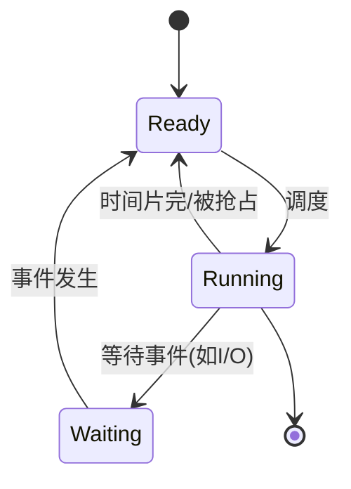

# 概述

## 并发与并行

### 并发

如果两个活动的起止时间有重叠，则称两个活动是并发执行的。

### 并行

如果两个程序在在同一时间运行在不同的处理机上，则成为并行执行。

#### 并行一定是并发。

### 并发的特征

1. 间断性
2. 非封闭性
3. 不可再现性

> **程序顺序执行的特征**
> 
> 1. 顺序性
> 
> 2. 封闭性
> 
> 3. 可再现性

### Bernstein 条件

#### 两个进程可并发，当且仅当两个进程对同一共享变量只能同时读。

即：对于任意一个共享变量，一读一写或者两个都是写的情况都是不行的。

#### 伯恩斯坦条件是判断并发程序结果可再现的充分条件。

可以这么理解：假如两个都是写，那么这个变量最后的值取决于谁最后写这个变量。此时，如果改变两个进程的运行顺序，那么变量最后的值就难以预测，有可能再现失败。

[task]
[question]
下面哪种情况不会产生数据竞争：
[\question]
[options]A 两个进程依次串行访问共享变量[\options]
[options]B 两个进程同时访问共享变量，同时为读[\options]
[options]C 两个进程同时访问共享变量，同时为写[\options]
[options]D 两个进程同时访问共享变量，一个读一个写[\options]
[answer]AB[\answer]
[analysis]
数据竞争（data race）是指两个或多个进程/线程并发访问同一共享变量，且**至少有一个访问是写操作**，同时没有使用同步机制。

选项 A 中两个进程**依次串行**访问，不存在并发，不会产生数据竞争。

选项 B 中两个进程**同时读**，没有写操作，也不会产生数据竞争。

选项 C 中两个进程**同时写**，选项 D 中**一个读一个写**，均满足数据竞争的定义条件。[\analysis]
[\task]

## 进程

### 程序、进程、作业的关系

| **对比项**   | **程序**      | **进程**        | **作业**               |
| --------- | ----------- | ------------- | -------------------- |
| **本质**​   | 静态的指令集合（文件） | 程序的**动态**执行过程 | 用户要求计算机完成的某项任务（工作集合） |
| **状态**​   | 永久          | 暂时，有生命周期      | 有提交、收容、执行、完成阶段       |
| **组成**​   | 代码          | 程序 + 数据 + PCB | 通常包括程序、数据、操作说明书      |
| **对应关系**​ | 一个程序可对应多个进程 | 一个进程可执行多个程序   | 一个作业可由多个进程组成         |
| **调度单位**​ | 否           | 是（传统OS中）      | 批处理系统中提交的实体          |

### 进程控制块

进程存在的**唯一标志**，管理和控制进程的核心数据结构。

### 进程的三大基本状态

#### 就绪、运行、阻塞。

- 就绪：已获得除 CPU 外的所有资源。
- 运行：正在 CPU 上执行。
- 阻塞：等待某事件完成。



## 线程

进程中的一个实体，是 CPU**调度和分派的基本单位**，只拥有必不可少的少量资源（如程序计数器、栈、寄存器状态），与同进程的其他线程共享所有进程资源。

# 进程同步

## 同步与互斥

### 临界区

**临界资源**：我们将一次仅允许一个进程访问的资源称为临界资源（如打印机）。

**临界区**：每个进程中访问临界资源的那段代码称为临界区。

### 进程互斥

两个或两个以上的进程，不能同时进入关于同一组共享变量的临界区域，否则可能发生与时间有关的错误，这种现象被称作进程互斥。

#### 程序一般不希望会出现进程互斥。

### 进程同步

进程同步是进程间的一种**刻意安排的**直接制约关系。即为完成同一个任务的各进程之间，因需要协调它们的工作而相互等待、相互交换信息所产生的制约关系。

进程同步的目的是：系统中各进程之间能有效地共享资源和相互合作，从而使程序的执行具有**可再现性**。

### 临界区管理的条件

1. 没有进程在临界区时，想进入临界区的进程可进入。
2. 任何两个进程都不能同时进入临界区。
3. 当一个进程运行在它的临界区外面时，不能妨碍其他的进程进入临界区。
4. 任何一个进程进入临界区的要求应该在有限时间内得到满足。

### 同步机制应遵循的原则

根据临界区管理的条件，在设计同步机制的时候必须遵循以下原则：

1. 空闲让进；
2. 忙则等待；
3. 让权等待；
4. 有限等待。

### 基于忙等待的方法

- Dekker 算法（软件方法）

1. 表示自己想进入临界区（`flag[i] = 1`）；
2. 如果另一个进程也想进入临界区，则查看是否轮到自己（`turn == i`）；
3. 若轮到自己，则进入；否则，主动放弃（`flag[i] = 0`），并循环等待机会（**忙等**）。

---

- Peterson 算法（软件方法）

1. 表示自己想进入临界区（`flag[i] = 1`）；
2. 主动将机会让给别人（`turn = j`）；
3. 若别人也想进入，则循环等待机会（**忙等**）。

[task]
[question]
Peterson 临界区算法适合哪种情况的调度：
[\question]
[options]A 抢占式[\options]
[options]B 非抢占式[\options]
[answer]A[\answer]
[analysis]
Peterson 算法适用于**抢占式调度**环境。它通过共享变量（`flag` 和 `turn`）在两个进程之间协调进入临界区的权限，假设进程可能在任何时刻被抢占并切换到另一个进程。在非抢占式调度下，进程会一直运行直到主动让出 CPU，此时临界区问题更容易解决（例如直接禁止中断），不需要 Peterson 算法这样复杂的软件方案。因此 Peterson 算法主要针对抢占式调度设计。[\analysis]
[\task]

---

- Bakery 算法（软件方法）

1. 进入临界区前，先取个号（取为当前最大号 + 1）；
2. 优先级为序号更小 > ID 更小；
3. 如果当前进程不是优先级最高的，循环等待机会（**忙等**）。

---

- 自旋锁（硬件方法）

【待完善】

> **忙等待的局限性**
> 
> 通过以下的例题进行补充说明。

[task]
[question]
忙等存在什么问题？
[\question]
[options]A 节省 CPU 资源[\options]
[options]B 可能导致优先级反转[\options]
[answer]B[\answer]
[analysis]
忙等（busy waiting）是指进程在等待某个条件成立时持续占用 CPU 并不断循环检查，而不是主动让出 CPU。这会带来以下问题：浪费 CPU 时间、降低系统吞吐量，并可能**导致优先级反转**——例如高优先级进程等待低优先级进程释放锁，而低优先级进程无法运行（被更高优先级进程抢占），高优先级进程持续忙等，形成死锁。

选项 A 错误，忙等恰恰是浪费 CPU 资源而非节省。[\analysis]
[\task]

## 基于信号量的方法

### 信号量机制

`S.value > 0` 时表示资源的个数，`S.value < 0` 时表示等待进程的个数。`P` 操作表示分配一个资源，如果无法分配则阻塞 `wait`，`V` 操作表示释放资源，如果有等待进程则唤醒 `signal`。

```C
typedef struct {
  int value;
  struct Process *L;
} semaphore;

void P(sempaphore s) {
  s.value--;
  if (s.value < 0) {
    block(s.L)
  }
}

void V(semaphore s) {
  s.value++;
  if (s.value <= 0) {
    // <=0是因为需要看++前是否<0
    wakeup(s.L);
  }
}
```

# 调度

## 批处理调度算法

### 先来先服务（FCFS）

First Come First Serve (FCFS)

#### 非抢占式的算法，最简单但也是效率最低的算法。

排在长作业后的短作业需要排很长时间才能排到，因此对长作业有利，对短作业不利。

### 短作业优先（SJF）

Shortest Job First (SJF)

#### 非抢占式的算法，平均等待时间和平均周转时间是最优的。

短作业会优先于长作业，导致对短作业有利而对长作业不利，且有可能因为源源不断到来短作业，导致长作业长时间得不到服务，称为“**饥饿**”，甚至“饿死”。

### 最短剩余时间优先（SRTN）

Shortest Remaining Time Next (SRTN)

#### 短作业优先的抢占式版本。

对长作业更不利，因为会频繁被抢断。

### 高响应比优先（HRRN）

Highest Response Ratio Next (HRRN)

$$
响应比 = \frac{等待时间+要求服务时间}{要求服务时间}
$$

该算法是对 FCFS 和 SJF 的综合考虑，同时考虑了作业的等待时间和预计运行时间，一定程度上缓解了长作业饥饿的现象。

[task]
[question]
以下说法不正确的是（）
[\question]
[options]A FCFS 调度算法对于长作业有利[\options]
[options]B SJF 调度算法会引起长作业被“饿死”的现象[\options]
[options]C SRTF 调度算法中正在执行的作业会因为新作业到达而被中断执行[\options]
[options]D HRRF 调度算法中，一个作业要求运行的时间越长，其响应比越大[\options]
[answer]D[\answer]
[analysis]
选项 A、B、C 均正确，选项 D 错误。
- 选项 A 正确：FCFS（先来先服务）算法中，长作业一旦开始执行会持续占用 CPU，短作业需要等待，因此对长作业有利。
- 选项 B 正确：SJF（短作业优先）算法中，若短作业不断到达，长作业可能永远得不到 CPU，产生“饿死”现象。
- 选项 C 正确：SRTF（最短剩余时间优先）是抢占式算法，新作业的剩余时间更短时会抢占当前正在执行的作业。
- 选项 D **错误**：HRRF（最高响应比优先）的响应比计算公式为 $\frac{(等待时间 + 要求运行时间) } {要求运行时间} = 1 + \frac{等待时间}{要求运行时间}$。要求运行时间越长，响应比中的分母越大，在其他条件相同时响应比反而越小。[\analysis]
[\task]