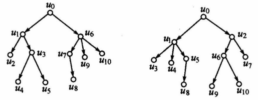
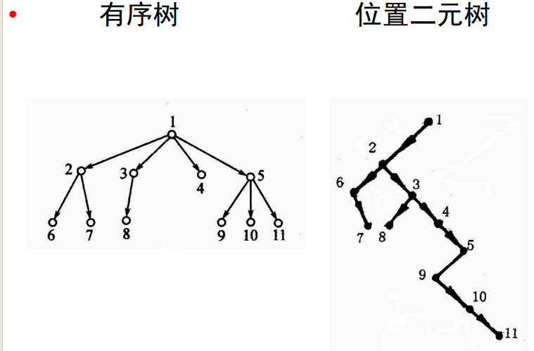

# 树的一般定义

## 树

连通且无圈的无向图称为树。

## 林

无圈的无向图称为林。林是每个连通分支都是树的无向图。

## 树的等价定义

设 $T$ 是 $(n,m)$ 无向图。以下说法是等价的。

#### $T$ 连通且无圈。

#### $T$ 无自环，并且每对顶点之间有唯一基本链。

#### $T$ 连通，在 $T$ 中加一边仅有一个圈。

#### $T$ 连通，去掉任何一边就不连通了。

#### $T$ 连通，并且 $m=n-1$。

#### $T$ 无圈，并且 $m=n-1$。

## 树叶、分支顶点

称树中次数是 $1$ 的顶点为树叶，次数大于 $1$ 的顶点为分支顶点。

#### 非平凡树中至少有两片树叶。

# 根树与有序树

## 有向树

若不考虑弧的方向，有向图 $D$ 成为树，则称 $D$ 为有向树。或者说，将一个树的边加上任意的方向，就得到有向树。

#### 任何有向树都是弱连通的无回路有向图，但是弱连通的无回路有向图未必是有向树。

因为有向图中，无回路不代表没有环状结构。

## 树根、根树

若有向树 $T$ 有一个顶点的引入次数为 $0$，其余顶点的引入次数都为 $1$，则称 $T$ 为根树。称根树中引入次数为 $0$ 的顶点为树根。

## 树叶、分支顶点、级

在根树中，称引出次数为 $0$ 的顶点为树叶，称既不是树根也不是树叶的顶点为分支顶点。从树根到一个顶点的通路的长度称为该顶点的级。

## 树高

在根树中，所有通路都是基本通路，从树根到每个顶点有唯一的通路。树根的级为 $0$。根树中顶点的级的最大值称为树高。

## 有序树

为顶点或弧指定了次序的根树是有序树。

若从顶点 $u$ 可以到达 $v$，则称 $v$ 为 $u$ 的后裔，$u$ 为 $v$ 的祖先。若 $<u, v>$ 是弧，则称 $v$ 为 $u$ 的儿子，$u$ 为 $v$ 的父亲，同一顶点的儿子互为兄弟。

作为根树，以上两棵树是一样的，但作为有序数是不一样的。

# 二元树

## M 元树、完全 m 元树、位置 m 元树

每个顶点的引出次数都小于等于 $m$ 的根树称为 $m$ 元树。

每个顶点的引出次数都等于 $m$ 或 $0$ 的根树称为完全 $m$ 元树。

若为 $m$ 元树 $T$ 中每个顶点的各儿子规定了位置，则称 $T$ 为位置 $m$ 元树。

## 有序树转换为位置二元树的算法

若 $u$ 是原来有序树的树根，则它仍然是转换后的位置二元树的树根。

在原来有序树中，

若顶点 $u$ 是 $v$ 的大儿子，则在转换后的位置二元树中，$u$ 是 $v$ 的左儿子；

若顶点 $u$ 是 $v$ 的大兄弟，则在转换后的位置二元树中，$u$ 是 $v$ 的右儿子。

有序树转换为位置二叉树的例子：

## 有序林

#### 每个弱分图都是有序树，并且为各有序树规定了顺序的有向图称为有序林。

如果称排在前面的有序树的树根是排在后面的有序树的树根的哥哥，并规定转换后的位置二元树的树根是有序林中第一个有序树的树根，则可按照上面的算法将有序林转换为位置二元树。

## 前缀码

若存在非空符号串 $\gamma$ 使得 $\alpha = \beta \gamma$，则称符号串 $\beta$ 是符号串 $\alpha$ 的前缀。设 $A$ 是字母表 $\{0, 1\}$ 上的语言，若不存在 $\alpha, \beta \in A$ 使得 $\beta$ 是 $\alpha$ 的前缀，则称 $A$ 为二元前缀码。

也就是说：

#### 集合里任一元素不是其他任何元素的前缀

例如，$\{00, 10, 11\}$ 是二元前缀码，$\{1, 00, 10, 11\}$ 不是二元前缀码。

## 二元树和二元前缀码

让位置二元树中的每个顶点对应一个 $\{0, 1\}$ 上的字，令所有树叶对应的字的集合为该位置二元树产生的二元前缀码。

## 顶点对应的字归纳定义如下

树根对应空字 $\epsilon$。

若顶点 $u$ 对应字 $\alpha$，则 $u$ 的左儿子对应 $\alpha 0$，$u$ 的右儿子对应 $\alpha 1$。

每个顶点对应字的长度等于该顶点的级。从顶点 $u$ 可以到达另一顶点 $v$ 当且仅当 $u$ 对应的字是 $v$ 对应的字的前缀。因为从一个树叶不可能到达另一树叶，所以位置二元树产生的语言是二元前缀码。反之，任意二元前缀码都可由一个位置二元树产生。

## 最优二元树

设位置二元树 $T$ 有 $t$ 片树叶，为每片树叶附加一个正实数作为权，得到一个带权二元树 $T$。如果第 $i$ 片树叶的权为 $P_i$，级为 $l_i$，则称 $P_1 l_1 + \ldots + P_t l_t$ 为带权二元树 $T$ 的权，记为 $m(T)$。

在所有带权为 $P_1, \ldots, P_t$ 的二元树中，权最小的带权二元树称为最优二元树。

设 $t \ge 2$，$P_1 \le P_2 \le \ldots \le P_t$，则存在一个带权 $P_1, ..., P_t$ 的最优二元树使得权为 $P_1$ 和 $P_2$ 的树叶是兄弟。

设 $t \ge 2$，$P_1 \le P_2 \le \ldots \le P_t$，$T$ 是带权 $P_1 + P_2, P_3, ..., P_t$ 的二元树。为 $T$ 中带权 $P_1 + P_2$ 的树叶增加两个分别带权 $P_1, P_2$ 的儿子得到带权 $P_1, ..., P_t$ 的二元树 $T'$。那么，$T$ 是带权 $P_1 + P_2, P_3, ..., P_t$ 的最优二元树当且仅当 $T'$ 是带权 $P_1, P_2, ..., P_t$ 的最优二元树。

## Huffman 算法

令 $S = \{P_1, P_2, \ldots, P_t\}$，画顶点 $U_1, U_2, \ldots, U_t$，使之分别带权 $P_1, P_2, \ldots, P_t$。

若 $S$ 是单元集则终止。

从 $S$ 中取出两个最小元 $x$ 和 $y$，设带权 $x$ 和 $y$ 的顶点分别是 $u$ 和 $v$，画 $u$ 和 $v$ 的父顶点 $w$，并使 $w$ 带权 $x + y$。

$S \leftarrow (S - \{x, y\}) \cup \{x + y\}$，转 2。

## 最优二元树的权

最优二元树的权为树根和各分支顶点的权之和。

# 12.4 生成树

## 生成树

若无向图 $G$ 的生成子图 $T$ 是树，则称 $T$ 为 $G$ 的生成树。

## 树枝、弦、补

设 $T$ 是无向图 $G$ 的生成树。称 $T$ 中的边为 $T$ 的树枝，称 $G$ 的不在 $T$ 中的边为 $T$ 的弦，弦的集合称为 $T$ 的补。$(n, m)$ 无向图 $G$ 的任何生成树有 $n - 1$ 个树枝，$m - n + 1$ 条弦。当然，$G$ 的某条边可能是这棵生成树的树枝，却是另一棵生成树的弦。

## 定理 12.7

#### 无向图 $G$ 有生成树当且仅当它是连通的。

## 基本圈、基本圈组

$(n, m)$ 无向图 $G$ 的生成树 $T$ 有 $m - n + 1$ 条弦。任取 $T$ 的一条弦 $e$，$T + e$ 有唯一的圈，它由树枝和弦 $e$ 组成，称这样的圈为对应于弦 $e$ 的基本圈。由这 $m - n + 1$ 个基本圈组成的集合称为关于生成树 $T$ 的基本圈组。

在下图中，树枝为 $h, a, b, c$；

基本圈组为
$\{ (h, a, e), (h, a, b, f), (h, a, b, c, g), (a, b, c, d) \}$

## 最小生成树

设 $G$ 是带权连通无向图，其中每条边 $e$ 的权 $c(e)$ 是正实数。$G$ 的生成树 $T$ 的各边权值之和称为 $T$ 的权，记为 $C(T)$。

设 $G$ 是带权连通无向图。在 $G$ 的生成树中，权值最小的树称为 $G$ 的最小生成树。

## Kruskal算法

求 $n$ 阶带权简单连通无向图 $G = <V, E>$ 的最小生成树，其中 $n > 1$。

选取权最小的边 $e_1, i \leftarrow 1$；

若 $i = n - 1$ 则终止；

选取 $E - \{ e_1, \cdots, e_i \}$ 中使得 $\{ e_1, \cdots, e_i, e_{i+1} \}$ 中无圈的权最小的边 $e_{i+1}$；

$i \leftarrow i + 1$，转 2。

$e_1, \cdots, e_{n-1}$ 构成 $G$ 的一个最小生成树。

# 12.5 割集

## 割集

设连通无向图 $G = <V, E>, E' \subseteq E$。若 $G - E'$ 不连通，即 $G$ 分离成为两个连通分支，并且对于任意 $E'' \subseteq E', G - E''$ 仍然连通，则称 $E'$ 为 $G$ 的割集。

## 割集的等价定义

$E'$ 是连通无向图 $G = <V, E>$ 的割集当且仅当存在 $V$ 的划分 $V_1, V_2$ 使得 $E' = \{(u, v)|(u, v) \in E \land u \in V_1 \land v \in V_2\}$，并且 $V_1$ 导出的子图和 $V_2$ 导出的子图都是连通的。

## 桥

#### $e$ 是 $G$ 中的桥当且仅当 $\{e\}$ 是 $G$ 的割集。

## 基本割集、基本割集组

设 $T$ 是 $(n, m)$ 连通无向图 $G$ 的生成树。因为从 $G$ 中去掉所有弦后仍连通，所以每个割集中必有树枝。因为从 $G$ 中去掉所有弦和一个树枝后不再连通，所以，对于每个树枝都存在由它和若干弦组成的割集。我们称只包含一个树枝的割集为基本割集。显然，有 $n - 1$ 个基本割集。称由这 $n - 1$ 个基本割集组成的集合为关于生成树 $T$ 的基本割集组。

## 定理 12.8

每个圈与任何生成树的补（即弦的集合）至少有一条公共边，即：

#### 每个圈中都包含弦。

## 定理 12.9

每个割集与任何生成树至少有一条公共边，即：

#### 每个割集中都包含树枝。

## 定理 12.10

#### 任何圈和任何割集都有偶数条（包含零条）公共边。

## 定理 12.11

给定图 $G$ 的生成树 $T$。设 $D = \{e_1, \ldots, e_k\}$ 是基本割集，其中 $e_1$ 是树枝，$e_2, \ldots, e_k$ 是弦，则 $e_1$ 包含在对应于 $e_2, \ldots, e_k$ 的基本圈里，但不包含在任何其它基本圈里。

## 定理 12.12

给定图 $G$ 的生成树 $T$。设 $C = (e_1, \ldots, e_k)$ 是基本圈，其中 $e_1$ 是弦，$e_2, \ldots, e_k$ 是树枝，则 $e_1$ 包含在对应于 $e_i(i = 2, \ldots, k)$ 的基本割集中，但不包含在任何其它基本割集中。

在左图中，树枝为 $h, a, b, c$；

基本圈组为 $\{ (h, a, e), (h, a, b, f), (h, a, b, c, g), (a, b, c, d) \}$

基本割集组为 $\{ (c, g, d), \{b, f, g, d\}, \{a, e, f, g, d\}, \{h, e, g, f \}\}$

显然：$c$ 只包含在对应于 $g$ 或者 $d$ 的基本圈 $(h, a, b, c, g)$ 或 $(a, b, c, d)$ 中；$e$ 只包含在对应于 $h$ 或者 $a$ 的基本割集 $\{h, e, g, f\}$ 或 $\{a, e, f, g, d\}$ 中。