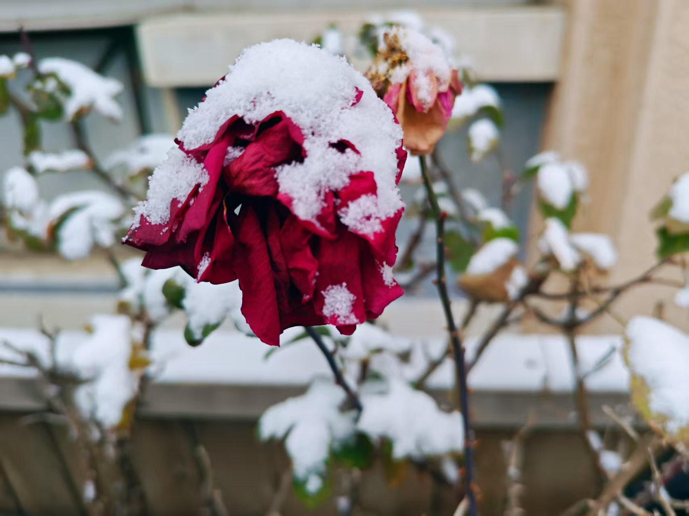
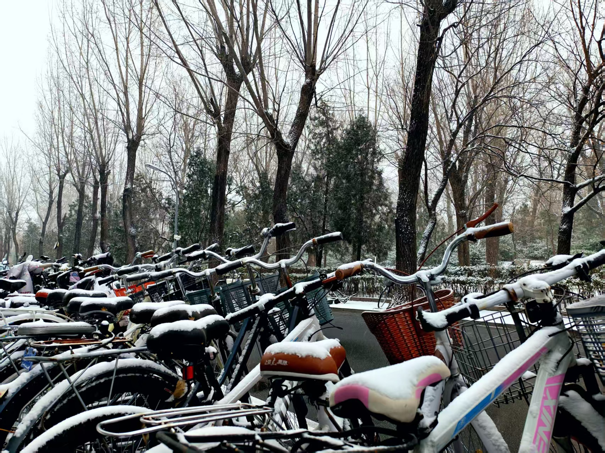
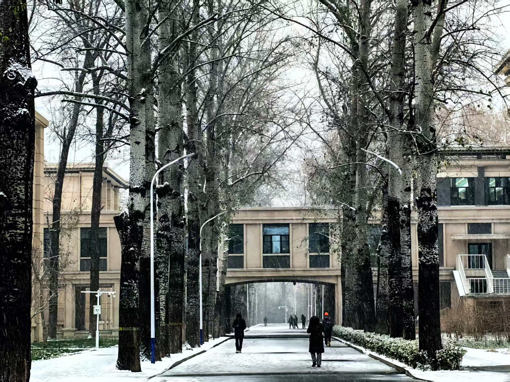
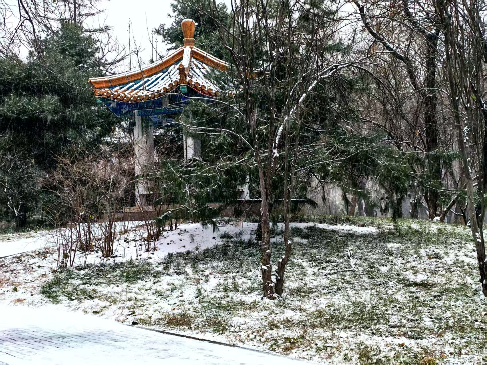
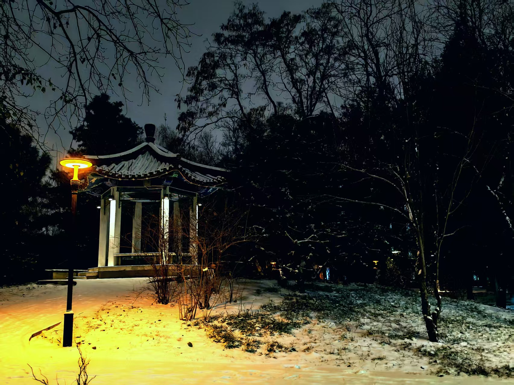

# 正文

$$
行香子·初雪
$$

#### 身临初雪，零余银灰$^①$。踏酥絮、满目霜飞。驻足欲赏，寒意相催。才东风过、西风定、北风吹。 溯光行远，雅心难回$^②$。叹光阴、逝者无归。巫山不再，但留长悲。尽蓦然叹、凄然情、潸然泪。

# 配图

## 雪中依旧半绽的月季

## 雪中整齐停放的自行车

## 三教与主楼间的连廊

## 昼夜轮换中的亭子

# 补充说明

## 注释

① 【身临初雪，零余银灰】谐音“圣聆初雪”、“凛御银灰”。

② 【溯光行远，雅心难回】谐音“溯光星源”、“崖心”。以上四个角色都是明日方舟中的角色。明日方舟六周年活动中，“凛御银灰”、“圣聆初雪”是卡池六星角色，与“崖心”为三兄妹。而“溯光星源”才是赠送六星角色。崖心之前已经前往“莱茵生命”，故没有成为赠送六星角色，故称“崖心难回”。

## 写作背景

2025年12月12日，北京迎来了今年的初雪。

大一在校期间，北京只稀疏地下了一点小雪，连路面都看不到积雪，终于有一次能够让我看到银装素裹的北航了。

对于一个南方人来说，雪是何其珍贵的存在。可我却并没有过多雅致去玩雪，甚至一想到雪停后总会消失，便莫名感到一阵惆怅。

加上最近事务繁杂、学业操劳，实在难有喜悦，故作此词。

## 写作思路

### 上阙

写景+叙事。雪踩上去的感觉是很奇妙的，虽然小时候也见过大雪，但毕竟过去良久，再次感受这种酥软的感觉与嗤嗤的响声，心又回到了儿时与家人堆雪人时的画面。看完脚下抬头，雪被风吹进帽子，吹到眼镜上，然后悄然融化、蒸发。有多少次想要拿出手机记录美景，可手总是冻得通红，只得放回口袋。

### 下阙

抒情。如今一直在为了学业进步身心交瘁，曾经一个渴望自由与美的准大学生，如今却找不到机会成为梦想中的自己。不知不觉已经来到大二，想得到的事物仍未在手中，甚至可能再也无法得到。再看到如此凛冽的风雪，便心中难抑伤感。